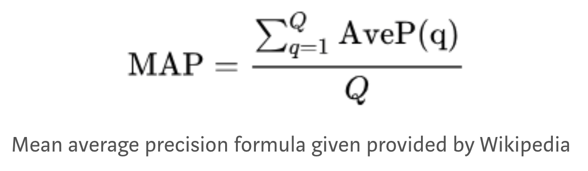

# Stanford Cars Classification Challenge by Grab
AI for SEA Cars Classification Challenge

- [Problem Statement](#proj-stat)
- [Project Structure](#proj-struc)
- [Experimentation](#exp)
- [Preparing Dataset](#preparing-dataset)
- [Creativity](#creativity)
- [Evaluation](#eval)
- [TO-DO](#to-do)

<a name="proj-stat"></a>
## 1. Problem statement
The objective of this project is to train a machine learning model to recognize the `model` and `make` of cars automatically.

<a name="proj-struc"></a>
## 2. Project Structure
The project data and codes are arranged in the following manner:

```
stanford_cars
  ├── src_detection
  |   ├── train.py
  |   ├── config.py
  |   ├── training/
  |   ├── evaluation/
  |   ├── networks/   
  |   └── utils/
  ├── data
  |   ├── raw
  |   |    ├── cars_train/
  |   |    |    ├── ....
  |   |    |    ├── train_annotations.csv
  |   |    |    ├── val_annotations.csv
  |   |    |    ├── class_mapping.xml_to_csvs
  |   |    ├── cars_test/
  |   |    ├── pretrained/
  |   |    |      |-
  |   |
```

_Data_: <br>
the `data` folder is not a part of this git project as it was heavy. The same can be downloaded from below link:

```sh
https://ai.stanford.edu/~jkrause/cars/car_dataset.html
```

<a name="exp"></a>
## 3. Experimentation
I tried two approaches here:

**Approach 1(two stage approach):**
First use a car detection model to get the car bounding box from the image. Subsequently crop the car from the image and then run an image classification algorithm on the image.
This method was doing feature extraction twice and so the total throughput of this operation was high.

**Approach 2(one stage approach):**
Car classification by detection first using one-stage detectors like retinanet. With this approach my accuracy was comparable to the two stage approach however my throughput time as reduce to 0.30secs which was very impressive.

<a name="preparing-dataset"></a>
## 4. Preparing dataset

  1. To enable dynamic loading of data with the help of Keras Generator and easy shuffling of data for different experiments, the data generator is prepared from `Keras.utils.Sequence`

  2.

  3. Annotations format
  The CSV file with annotations should contain one annotation per line. Images with multiple bounding boxes should use one row per bounding box. Note that indexing for pixel values starts at 0. The expected format of each line is:

  ```
  path/to/image.jpg,x1,y1,x2,y2,class_name
  ```

  4. Class mapping format
  The class name to ID mapping file should contain one mapping per line. Each line should use the following format:
  ```
  class_name,id
  ```

<a name="creativity"></a>
## 5. Creativity/Project USP

**1. Loss Function:** <br>
I am using a weighted form of object detection loss to focus the training more on classification rather than object detection. Object Detection is important for extracting the correct feature from the image but here I felt even with low IoU, we should get the correct classification.

The loss function that I am using is:
<div style="text-align: left"></div>
<br>

Where Focal Loss is given as:
<div style="text-align: left"></div>
<br>

**2. Architecture:** <br>
I have chosen the retinanet architecture for this project and the same is represented as:

<div style="text-align: left"></div>
<br>

**3. Fully Convolutional Network:** <br>
The network is fully convolutional.
This enables resize of image by scale. This is very important as I think scale will play a key distinguishing factor in differentiating between some categories.  

Consider the following two images for example:
<div style="text-align: left"></div>
<br>

<div style="text-align: left"></div>
<br>

**4. Accuracy Metric** <br>
I am using Mean Average Precison as my accuracy metric. Its a function of both precision and recall. It is given as:

<div style="text-align: left"></div>
<br>


**5. Cyclic Training** <br>
The training of retinanet was done in 4 iterations:

*Training Iteration 1:* <br>
Hyperparameters: Epochs = 20, L1_loss_weight = 1.0 Focal_Loss_Weight = 1.0, Learning_rate=0.01 <br>
mAP: 0.198

*Training Iteration 2:* <br>
Hyperparameters: Epochs = 20, L1_loss_weight = 0.8 Focal_Loss_Weight = 1.2, Learning_rate=0.01 <br>
mAP: 0.252

*Training Iteration 3:* <br>
Hyperparameters: Epochs = 10, L1_loss_weight = 0.5 Focal_Loss_Weight = 2.0, Learning_rate=0.001 <br>
mAP: 0.285

*Training Iteration 4:* <br>
Hyperparameters: Epochs = 10, L1_loss_weight = 0.2 Focal_Loss_Weight = 5.0, Learning_rate=0.001 <br>
mAP: 0.319

The training script is `train.py` <br>

The entire training configuration including the dataset path, hyper-parameters and other arguments are specified in `config.py`, which you can modify and experiment with. It gives a one-shot view of the entire training process. <br>


<a name="eval"></a>
## 6. Evaluation
For evaluation, the final model can be obtained from [here](https://drive.google.com/file/d/1IJLoxTYMo0q8xzC_0zI8JpMccN3nbZyf/view?usp=sharing)

The same has to be kept inside the `inference` folder in root.

For evaluation the model can be run using the notebook [here](./notebooks/inference_retinanet.ipynb)

<a name="to-do"></a>
## 7. To-Do
- [x] Data download and Analysis
- [x] Data scripts preparation
- [x] Data loader
- [x] Data Generator
- [x] Data Augmentor
- [ ] Add multi-gpu support for training
- [x] Generate priliminary results
- [ ] Add multiple network support
- [x] Training and Parameter Tuning (on-going)
